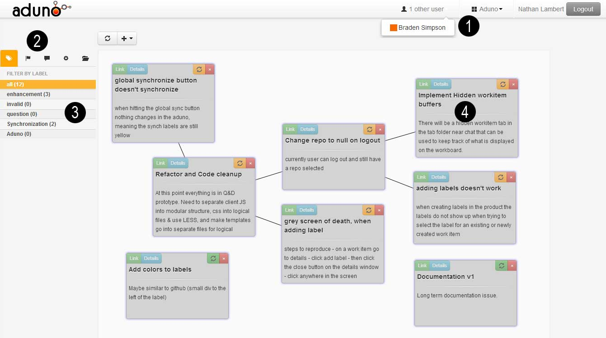

#CSc 582A Logbook
###Braden Simpson
###<a mailto="brsmp@acm.org">braden@uvic.ca</a>
###V00685500

####May 2
**How to check for impact of a paper** 

*	compare relative number of citations
*	check the *awards* for papers (ex. the turing award)
*	best paper awards @ conferences

**Conferences**

*	ICSE
*	SIAMS

Need to make a model for finding the important papers for me at ICSE..

**Due for monday:**

*	Identify some important papers in your area of interest (1 or 2) & why you think they are important
*	study & understand theoretical models / techniques
*	collaborate with others from different backgrounds
*	identify open problems where theory plays a role propose new problems
*	propose theoretical models that apply to real world problems

 

#### May 6
**Paper presentations**

Each person presented their paper(s) and described at a high level what the methods were and the theoretical background.

Then we split into groups of four and discussed the papers each person had in the group.
My group consisted of the following people/papers: 

* Laura Mcleod (Program comprehension based on latent semantic analysis)
* Devin (NP complete problem approximations)
* Jannon (Image procession using vector coordinates)
* Me (Finding fix-inducing changes in software repositories)

After discussing the papers, we decided that the paper I presented was most interesting, and are using it for the presentation next week.

Due for next class, start collaborating with the team members and decide how we're going to present "When do changes induce fixes"

 

####May 8
#Presenting "When do changes induce fixes"
###Plan

**Include these points in the presentation**

* Where is the evidence of impact for this paper
* Overivew of the paper highlights
* "Where is the theoretical" content of the paper
* Explanation of selected details

Started entering parts of the presentation, started with outline.

here is the link to the document

<a href="https://www.dropbox.com/s/x3yfc9rfnq21dxo/FixInducingPresentation.pdf">presentation.pdf</a>

###May 13
#Presentations
We started as group 1, completed our presentation, some interesting notes about 

Recommendations for our presentation
* recommender systems (which ones are out there)  
* What real-world uses are there?
* Grading is done on the presentations (tests)

**Adversarial Data Mining**
This talk/paper was about how to mask the data in released datasets such that the public/other parties can't infer unwanted information from the data through means of data-mining.  

Interesting paper, and talk, I think to make it clearer they should have refined their method of explaining FAiR more, as it was confusing.

This is a framework that is very applicable to real-world situations, as companies are forced to give out public datasets constantly, and it is necessary for the private information to stay private.  

###May 16
#Presentations
**Network Coding meets TCP**
Jordan Maneer and Candy

* very interesting, lots of real-word impact (M$, amazon, MIT)

**idea** Linear combinations of packets are sent instead of the packets themselves, and then the receiver solves for what packets it might have missed.  I guess that this would take a lot more processing time for the endpoints, but since the real bottlenecks in networks is the transmission, this must give a huge bonus.  

16x higher speeds recorded at MIT campus network where this was first implemented.  (no change to hardware)

**Fixed Parameter Tractable Algorithm for Fireghting Problem**
This was an interesting presentation, in that at the beginning I didn't know what the firefighter problem was, but it really is a great way of mapping the problem to a real-world example that people can grasp.

###May 18
#ICSE Mining Software Repositories Day One
Refer to my blog [here](http://braden.in/posts/icse-day-one.html) 

###May 19
#ICSE Mining Software Repositories Day Two
Refer to my blog [here](http://braden.in/posts/icse-day-two.html)

###May 20
#Day off from ICSE, Thoughts on Research Directions
Today I'm not going to any ICSE talks, I simply went to explore SF and think about how my research is going proceed after ICSE.  I have seen a ton of good papers in MSR outlined in the last two blog posts from my website.  For my master's thesis, I need to find *good* projects to test my application on (see it [here](http://aduno.braden.in)).  My master's is essentially about testing how software teams collaborate when creating tasks and articulation work, more specifically, can we use real-time web applications (such as the tool [**aduno**](http://aduno.braden.in) that I wrote.)

To do this I need to find a team with at least 4 members, that are using a process for creating tasks in the software design phases and offer them aduno to try and get an evaluation on how it affects their process. 	 

I'm really looking for papers that might outline better ways to test collaborative tools on teams and compare the way they affect the development process. 

###May 21
#Day off from ICSE, More thoughts on Research 
Working on more ideas for my master's project, I am reading more papers on tool evaluation, live editing of documents, and graph layout algorithms.  The reason I need graph layout algorithms, is my tool displays Work Items on a canvas, and they can potentially be linked. See Below. 

</img>

I want to display these in the most appealing manner, so I've been looking at papers that introduce different graph layouts such as Force Directed Graph layout algorithms in [this paper](http://cs.brown.edu/~rt/gdhandbook/chapters/force-directed.pdf)

###May 22
#First Day of ICSE 2013
I wrote a blog on the first day of ICSE [here](http://braden.in/posts/icse_main_conference_day_one.html) 

I outline some of the most important papers to me in that blog.  The testing paper, shown first in the blog, was a theory intensive paper, although the content is out of my knowledge scope. 

###May 23
#Second Day of ICSE 2013
The second day of ICSE started with a keynote from Tony DeRose, Lead Research Scientist at Pixar.  This talk was amazing, he went in depth about the movie-making process at Pixar and made parallels to software engineering.  As well he talked about how they designed software in house for making the Pixar movie. 

This was interesting because my research interests are to do with software teams and how they collaborate, this is very easy to represent in *graphs* and *social networks* 

For this reason, graph theory can be a fundamental building block for software engineering research.  Will need to look more into the references of each paper that uses social networks.

One of the most interesting papers of today was about how we can manage all of the cloud services that many software teams need to manage in one place.  For instance, when a team has a product they deploy to the cloud, they typically have someone who focuses on [link](http://amazon.com)

###May 24
#Third Day of ICSE 2013
Today there wasn't much talk about theory applications, but there were multiple talks that were interesting.  I enjoyed a talk about Dual Ecologies which was done by Daryll Possnett, and has a lot of references to the theory of entropy.  I think this was the best theory based paper in the conference.  
[link](http://macbeth.cs.ucdavis.edu/enteco.pdf)

The paper says it uses entropy, and another measure called Kulback Liebler divergence to measure the focus on files and the expertise of a developer.  This was done to find the amount of focus and activity, and to relate that to defects in the system.  
 
