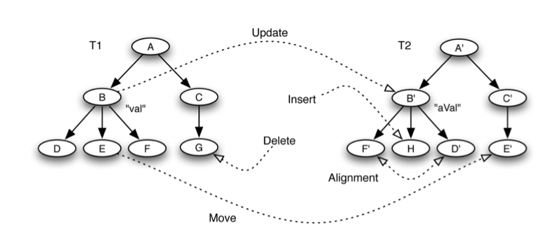
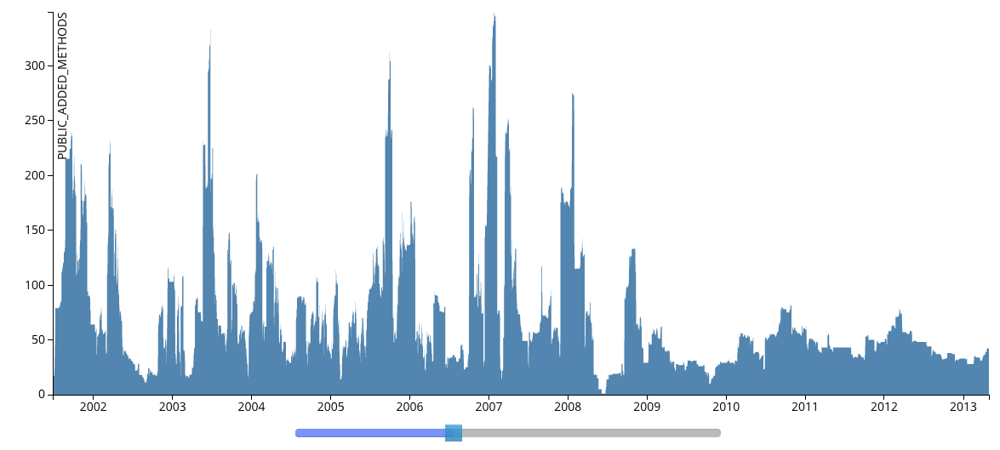

#Logbook part 2
##Braden Simpson
###V00685500

###June 12th
As part of the work for preparing for this wednesday's class after the large break, we have to come up with a definition for a theoretical model.  I came up with this: 

```
A formally defined abstract method or object description that is generalized and can be used to solve or support multiple different problems.
```

I'm also going to be re-reading all the papers presented by the groups for the upcoming midterm.

Interesting discussion on what a theoretical model is, these are the keywords that stood out for me during the discussion: 

* formal definition
* rules
* abstraction
* probability
* axioms
* notation
* proof
* algorithms
* gamification
* visualization

I think that a theoretical model is a combination of these, suited to whatever the theoretical model needs to describe. 

###June 15th 
I chose markov models to investigate for my personal theoretical model, because I had heard a lot about them, but didn't actually know what they are.

I heard that google driverless cars use markov models for 'seeing' the world around them.  I wonder how that works.  

Another great resource on markov chains by google themselves, talking about how they use Markov chains for PageRank, their way to suggest links to web surfers.

[PageRank](http://www.dupuis.me/node/30)

http://www.dupuis.me/node/30

###June 24th
I decided to research instructional videos on Markov Chains (as I didn't really know what they were), and I found a ton of online videos about it.

Sequential or temporal data

[Part 1](http://www.youtube.com/watch?v=uvYTGEZQTEs)
[Part 2](http://www.youtube.com/watch?v=jtHBfLtMq4U)
[Part 3](http://www.youtube.com/watch?v=P8DuuiINAo4)
[Part 4](http://www.youtube.com/watch?v=31X-M4okAI0)
[Part 5](http://www.youtube.com/watch?v=-kwnnNSGFMc)

* http://www.youtube.com/watch?v=uvYTGEZQTEs 
* http://www.youtube.com/watch?v=jtHBfLtMq4U 
* http://www.youtube.com/watch?v=P8DuuiINAo4
* http://www.youtube.com/watch?v=31X-M4okAI0
* http://www.youtube.com/watch?v=-kwnnNSGFMc

[MIT lecture](http://www.youtube.com/watch?v=IkbkEtOOC1Y) http://www.youtube.com/watch?v=IkbkEtOOC1Y

[More examples](http://www.youtube.com/watch?v=Pce7KKeUf5w&list=PLF0F6A0B336591076) http://www.youtube.com/watch?v=Pce7KKeUf5w&list=PLF0F6A0B336591076

The markov model seems like a very good way to model anything with sequential or temporal dependencies.  It appears to be a good way to represent a state of something that changes with time.  

As well I looked up a graph clustering algorithm called Markov clustering which uses the same unlerlying markov chain model, and has uses in bioinformatics.  

[Slides](http://www.cs.ucsb.edu/~xyan/classes/CS595D-2009winter/MCL_Presentation2.pdf) http://www.cs.ucsb.edu/~xyan/classes/CS595D-2009winter/MCL_Presentation2.pdf <br>
[homepage](http://www.micans.org/mcl/) http://www.micans.org/mcl/

Jordan talked about K-means and varoni graph models.

The Groups decided on *markov chains*, *markov clustering*, *bayesian networks*, *procedural generation*.


###June 26th 
Mathematical models vs Theoretical models

**Infection**

* Whats the difference?  Is there one?
  * Theoretical models are potentially less formal?
  * Mathematical modeling is always a trade off between
    * Simple models: highlight qualitattive behaviour
    * Detailed models; specific quantitative predictions
* Use the graph that she has about flow for modelling
* Sensitivity Analysis


**Networks**

* Are there any topologies that are more prevalent than others?


###June 28th 
I found some problems sets to do with markov chains: 

* [Problem set from berkeley, includes solutions.](http://www.cs.berkeley.edu/~sinclair/cs294/sol2.pdf)http://www.cs.berkeley.edu/~sinclair/cs294/sol2.pdf

Jordan and I initially talked about ideas around analyzing different properties of existing software projects. 
We came up with an idea to diff the commits of a project to find out what types of changes the projects were experiencing.


###June 29th - July 5
Jordan and I were having some interesting ideas about how to observe properties of API's over their lifespan, and one of the things that would be particularly useful is if we could have records of certain metrics.  Some of these metrics could be: 

* Changed methods
* Changed Classes
* Changed files
* High impact/Low impact changes

A way that we found to do this was to use Abstract syntax trees (ASTs), which are used as a model for source code structures.  These ASTs would be constructed at each commit and used to compare to the previous commit, revlealing the changes.  

###July 8
Jordan and I finished coding up the project.  We started by thinking of a couple good research questions, to guide what we want to build: 

* How do the types of changes (volumes, changetypes, # of commits) correlate with the projects milestones (releases, tags, etc.)
* What are the trends of changes during a projects lifetime?

We then thought of some metrics that were relevant with respect to those research questions, that would then be measured on a per-commit basis.

*  Changed Classes/Methods (public/private We are mostly interested in public though)
*  Added Classes/Methods
*  Removed Classes/Methods
*  Changed/Added/Removed Tests
*  File creation/Deletion
*  Changed Documentation
*  Low/Med/High significance level changes (changing an internal variable name -- Low, changing a public method signature -- high)

We then were looking for existing tools to assist us, and we found a tool called changedistiller (http://www.ifi.uzh.ch/seal/research/tools/changeDistiller.html) which find the differences between Abstract Syntax trees.  By iteratively going through all the commits of a project, building the AST for each commit (parent, child) and then differencing them, we are able to tell what parts of the Java class was changed.  See picture

<center></img><br>Change distiller tree differencing.  Fluri et al. [1]</center>

<br>

Then once we had the basic operations done and started running our code on projects, I wrote an interface and visualization for the data, accessible at http://ballroom.segal.uvic.ca -- See the visualization below.

<center></img></center>

<center>This is a visualization of the Eclipse JDT Core project, showing the amount of public added methods per commit</center>

We can see the trends in this data, and do analysis to find places where we could potentially predict stability(or instability) in the project.  Maybe markov models could be used as a predictor for this kind of data, we will have to find out.


[1] Beat Fluri, Michael Wuersch, Martin Pinzger, Harald Gall. **Change Distilling: Tree Differencing for Fine- Grained Source Code Change Extraction** IEEE Transactions on Software Engineering.

###July 9
This project that i'm working on with jordan has huge potential, we are planning to write a paper and submit to ICSE 2014 MSR. (International Conference On Software Engineering, Mining Software Repositories).  We will be talking about the effects of code changes on releases and how the API lifecycle can be analyzed as well as share all of our data with the community.  

We could perhaps get another paper going for how the the data can be used to predict stability and other attributes of projects.  

On a totally unrelated note, I really like the procedural generation topic that has been placed around in class, and think there is a lot of interesting applications for this.  One quick one that I could think of was to procedurally generate communities of people, and then test out the different infection models that Pauline van den Driessche spoke about in her slides on infections and vaccinations.  


